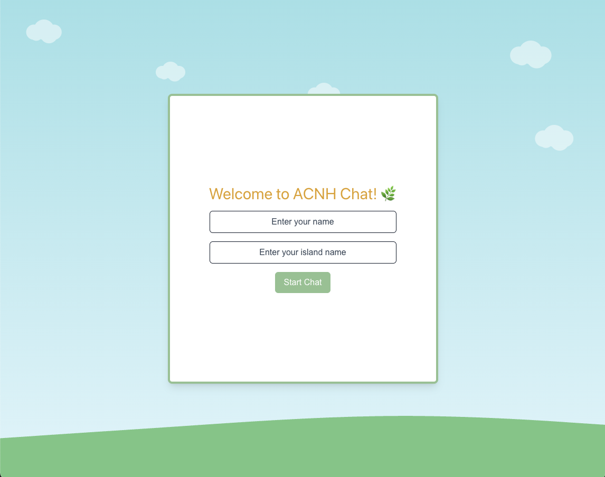
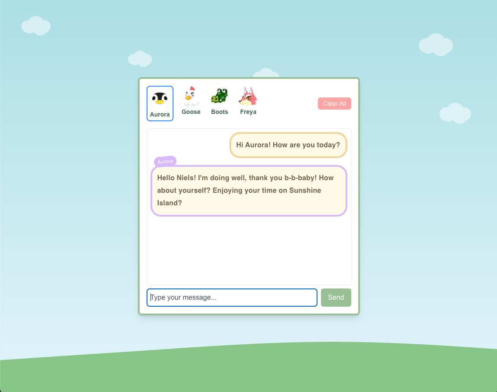
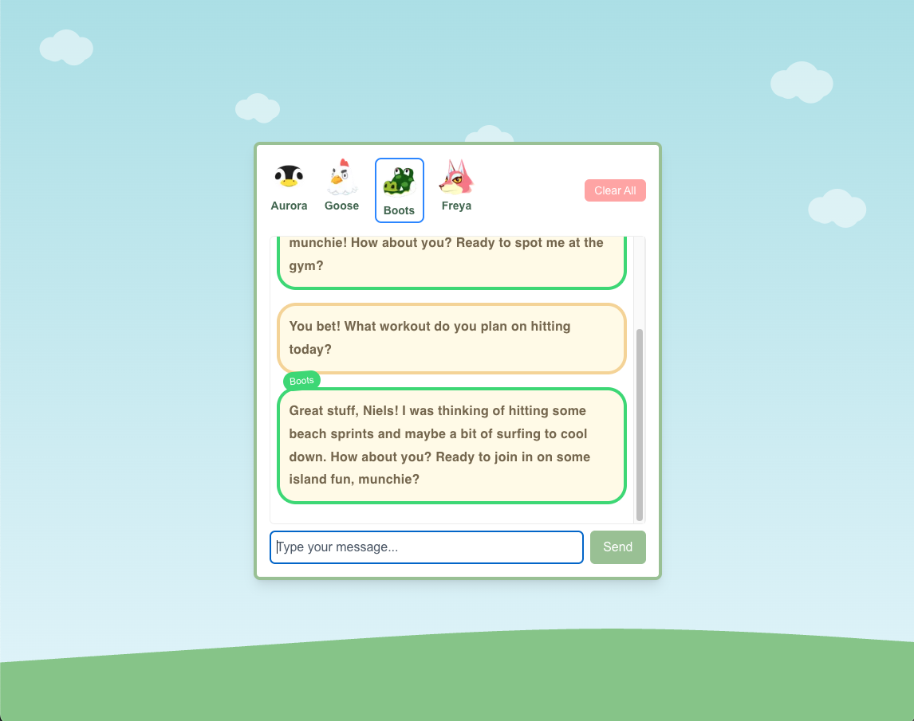

# 🏝️ ACNH Chat  
**A fun chat app where you can talk to your favorite Animal Crossing villagers! 🍃**  

## ✨ Features  
- **Chat with multiple villagers** 🎉  
- **Villagers have unique personalities & catchphrases** 🗣️  
- **Messages appear in a bubbly Animal Crossing-style chatbox** 💬  
- **Typewriter effect for villager responses** ⌨️  
- **Auto-scroll to latest message** 📜  
- **Villagers remember past messages** 🔄  
- **Custom theme and styling inspired by Animal Crossing** 🌿  

---

## 🛠️ Tech Stack  
- **Framework**: [Next.js](https://nextjs.org/)  
- **Styling**: Tailwind CSS  
- **Backend AI**: [Mistral API](https://mistral.ai/)  
- **State Management**: React Hooks  

---

## 📸 Screenshots  

### 🏝️ Start Screen  
  

### 💬 Chatting with Aurora 🐧 
  

### 🎨 Chatting with Boots 🐊
  

## 🚀 Getting Started  

### **1️⃣ Clone the repository**  
```sh
git clone https://github.com/your-username/ACNH_Chat.git
cd ACNH_Chat
```

### 2️⃣ Install Dependencies
```sh
npm install
# OR
yarn install
```

### 3️⃣ Set Up Environment Variables
Create a .env.local file and add your Mistral API Key:
```sh
NEXT_PUBLIC_MISTRAL_API_KEY=your_api_key_here
```

### 4️⃣ Run the Development Server
```sh
npm run dev
# OR
yarn dev
```

Open http://localhost:3000 to see the app in action! 🚀

## 🎨 Customization

**Add More Villagers**
	1.	Open app/data/villagers.ts
	2.	Add a new villager with their image, catchphrase, and personality:

```ts
//Marshall as an example
export const villagers = {
  marshall: {
    img: "/characters/Marshall_NH_Villager_Icon.png",
    bubbleColor: "#6e6969",
    name: "Marshall",
    catchphrase: "sulky",
    personalityTraits: ["Smug", "Charming", "Cool"],
    personalityDescription: "Marshal is a villager that falls under the smug personality. He will not find it hard to converse with other villagers, as he is very polite and lively. He also may be seen flirting with the player, regardless of their gender. He may sometimes appear conceited when talking to himself. His unseen hobby is dancing, and will also enjoy the usual hobbies.",
  },
};
```

**Adjust Message History Limit**
Modify the MESSAGE_HISTORY_LIMIT in ChatWindow.tsx:
```ts
const MESSAGE_HISTORY_LIMIT = 8; // Adjust how many past messages are remembered
```

## 🐛 Troubleshooting  
### API Key Not Working?  
- Ensure your **Mistral API key** is correctly set in `.env.local`.  
- Restart the development server: 
```sh
npm run dev
```

## 🌱 Future Ideas & Enhancements
Here are some cool features that would be interesting to add in the future. 

### 👥 Villager Interactions
- Villagers will be able to **talk to each other** and react to past conversations!  

### 🌟 More Villagers
- Expanding the roster to include **more Animal Crossing characters** with unique personalities.  

### 📜 Improved Villager Selection
- Moving the **villager selection** to its own **dedicated window** instead of being at the top.  

### ⏳ Themed Conversations
- **Time of Day Chat:** Villagers will greet you differently in the **morning, afternoon, or night**.  
- **Seasonal Chat:** Special dialogues for **Spring, Summer, Fall, and Winter**!  
- **Event-Based Chat:** During **holidays or special events**, villagers will have unique conversations.  

## 📜 License
This project is licensed under the MIT License. Feel free to use, modify, and share! 🎈

## ✨ Contributors
👤 Niels – Creator & Developer
🐾 Inspired by Animal Crossing: New Horizons

***🌟 If you like this project, don’t forget to give it a star on GitHub! ⭐***
